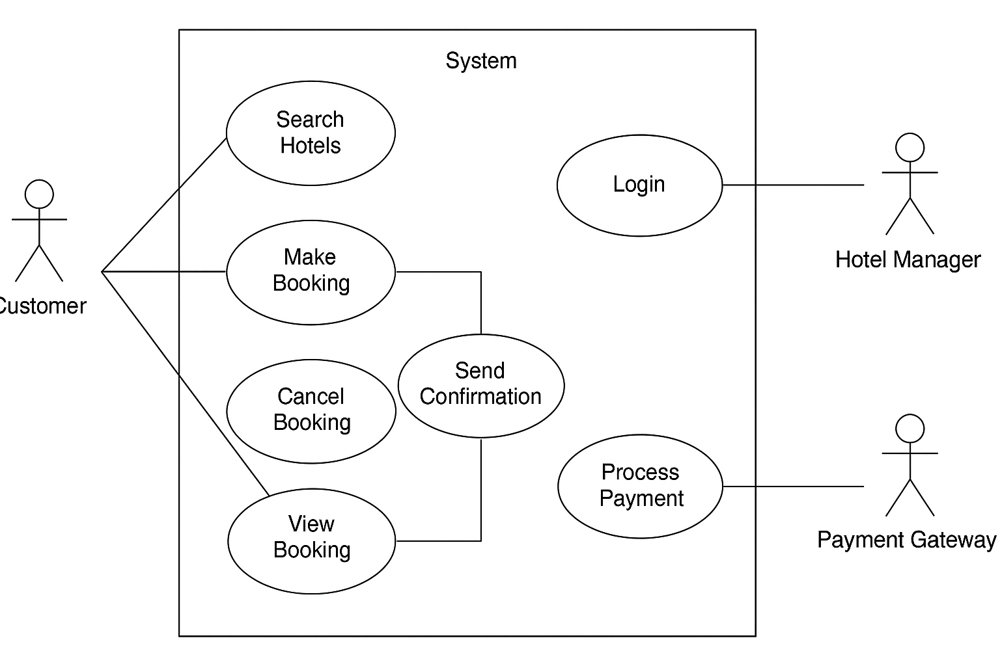

# Requirement Analysis in Software Development

This repository contains notes, resources, and examples related to **Requirement Analysis**—an essential phase in software development. 

Requirement analysis helps identify **what a system should do**, gather stakeholder expectations, define system boundaries, and ensure the final product aligns with user needs. This repository will serve as a reference and documentation hub for exploring this critical process.

---

## What is Requirement Analysis?

**Requirement Analysis** is the process of identifying, gathering, and defining the needs and expectations of stakeholders for a new or modified product. It involves understanding **what the users require** from a system and ensuring those needs are clearly documented and agreed upon before development begins.

### 🔍 Key Activities Include:
- **Eliciting requirements** from stakeholders (through interviews, surveys, observation, etc.)
- **Analyzing and refining** those requirements
- **Documenting** the requirements in a structured form (such as SRS – Software Requirements Specification)
- **Validating and verifying** that requirements are clear, complete, and feasible

### 📌 Importance in the Software Development Lifecycle (SDLC):
1. **Foundation for Development:** Acts as the blueprint for design, development, and testing.
2. **Reduces Errors and Rework:** Clear requirements help avoid misunderstandings and costly changes later in the project.
3. **Ensures Stakeholder Satisfaction:** Ensures that the final product meets the actual needs of users and clients.
4. **Improves Planning:** Enables more accurate estimation of time, cost, and resources.
5. **Supports Quality Assurance:** Provides a basis for creating test cases and validating that the system meets its goals.

Without proper requirement analysis, a project risks failure due to poor understanding of what needs to be built. It is often said: **"Building the wrong system perfectly is still a failure."** That’s why this phase is critical in any successful software development effort.
## Why is Requirement Analysis Important?

Requirement Analysis plays a pivotal role in the Software Development Life Cycle (SDLC). Here are three key reasons why it is essential:

### 1. Prevents Miscommunication and Misunderstandings
Clearly defined requirements ensure that all stakeholders—including clients, developers, testers, and designers—share a mutual understanding of the system's goals. This alignment minimizes the risk of misinterpretation and keeps everyone on the same page.

### 2. Saves Time and Cost
Identifying and correcting requirement-related issues during the early stages is far less expensive than fixing them later in the development or post-deployment phases. Requirement analysis helps avoid unnecessary rework, reduces project delays, and ensures optimal use of resources.

### 3. Improves Product Quality and User Satisfaction
Accurate and complete requirements lead to the development of software that meets user expectations and business needs. This enhances customer satisfaction and results in a product that is both functional and valuable.
## Key Activities in Requirement Analysis

Requirement Analysis involves several structured activities to ensure that the system meets the needs of stakeholders. Below are five key activities commonly performed during this phase:

- **Requirement Gathering**
  - This is the initial step where raw requirements are collected from stakeholders, customers, and end users.
  - It focuses on identifying high-level business needs and objectives.

- **Requirement Elicitation**
  - Involves using techniques like interviews, questionnaires, workshops, and observation to extract detailed requirements.
  - It bridges the communication gap between stakeholders and technical teams.

- **Requirement Documentation**
  - All gathered and elicited requirements are recorded in formal documents such as the Software Requirements Specification (SRS).
  - Clear documentation ensures traceability and acts as a reference throughout the project lifecycle.

- **Requirement Analysis and Modeling**
  - The collected requirements are analyzed for completeness, consistency, feasibility, and priority.
  - Models such as use case diagrams, data flow diagrams (DFDs), or UML are often created to visualize the system.

- **Requirement Validation**
  - Ensures that the documented requirements accurately reflect stakeholder needs and are realistic, testable, and unambiguous.
  - This often involves walkthroughs, reviews, and stakeholder approval.
## Types of Requirements

Understanding the different types of requirements is critical to building a reliable and scalable hotel booking system. These requirements are typically classified into **Functional** and **Non-functional** categories.

---

### Functional Requirements

Functional requirements describe **what the system should do**. They define the behavior of the system based on user interactions and business needs.

#### Examples from the Booking Management Project:

- **Hotel Management Service:**
  - Hotel managers can log in to a separate portal to manage hotel data.
  - Managers can update hotel details like room availability, pricing, photos, and amenities.
  - The system should sync updates to the master database and reflect changes in real-time.

- **Customer Service (Search + Booking):**
  - Users can search for hotels by date, location, and preferences.
  - Users can make bookings through a booking interface.
  - Customers can cancel or reschedule bookings.
  - The system should interact with a payment gateway for completing bookings.

- **View Booking Service:**
  - Users (both customers and managers) can view current and past bookings.
  - The system should retrieve recent booking data from Redis cache and archive data from Cassandra.

---

### Non-functional Requirements

Non-functional requirements describe **how the system should behave**. These include performance, reliability, scalability, and usability characteristics.

#### Examples from the Booking Management Project:

- **Performance:**
  - The system must support high traffic and concurrent user access using load balancers and server clusters.
  - Page load time should be optimized (e.g., using Redis for caching and ElasticSearch for fast querying).

- **Scalability & Availability:**
  - The application should follow a microservices architecture to scale individual components independently.
  - Services like Kafka and Cassandra should be used to handle high throughput and data archival.

- **Security:**
  - Secure login for both hotel managers and customers.
  - Payment service must integrate securely with third-party payment gateways.

- **Reliability & Data Consistency:**
  - Use of master-slave DB replication ensures consistent and reliable data access.
  - Changes must be reliably propagated to consumers via a messaging queue (Kafka).

- **User Experience:**
  - The system should provide a seamless user experience through a Content Delivery Network (CDN) for fast data loading.
  - The booking interface must be mobile-friendly and responsive.
## Use Case Diagrams

Use Case Diagrams are a type of Unified Modeling Language (UML) diagram used in Requirement Analysis to visually represent the **functional behavior** of a system from a user's perspective.

### 🎯 Purpose:
They help identify the **interactions between actors** (users or systems) and **use cases** (tasks the system performs). These diagrams make it easier to communicate requirements with both technical and non-technical stakeholders.

### ✅ Benefits of Use Case Diagrams:
- Clearly defines system boundaries and responsibilities
- Enhances communication between developers and clients
- Helps identify all functional requirements
- Aids in test case development and planning

---

### 🖼️ Booking System Use Case Diagram

Below is the use case diagram for the booking system, illustrating the key actors and their interactions with the system:

### 👥 Actors:
- **Customer**: Searches hotels, books, cancels, views bookings
- **Hotel Manager**: Logs in, updates hotel details, views bookings
- **System**: Sends confirmation, processes payments

### 🔧 Use Cases:
- Search Hotels
- Make Booking
- Cancel Booking
- View Booking
- Login (for Hotel Manager)
- Update Hotel Info
- Send Confirmation
- Process Payment
## Acceptance Criteria

Acceptance Criteria are a set of **conditions that a software product must satisfy** to be accepted by the user, customer, or other stakeholders. These criteria define the boundaries of a user story or requirement and ensure that development and testing teams understand what “done” means for a given feature.

### ✅ Importance in Requirement Analysis

- **Clarity**: Provides clear expectations for what needs to be built and tested.
- **Alignment**: Ensures that all stakeholders (developers, testers, clients) agree on the functionality before development begins.
- **Verification**: Acts as a checklist during testing to confirm that the feature works as intended.
- **Reduces Scope Creep**: Helps prevent unwanted changes or ambiguous requirements during development.

---

### 🛒 Example: Acceptance Criteria for the Checkout Feature

**Feature:** Checkout functionality in the booking management system

#### Acceptance Criteria:

1. ✅ Users must be able to proceed to checkout only if they are logged in.
2. ✅ The system should display the final booking summary including hotel name, room type, dates, and total cost.
3. ✅ The user must enter valid payment details before confirming the booking.
4. ✅ Upon successful payment, the system must generate a unique booking reference number.
5. ✅ The system must send a confirmation email with booking details to the user.
6. ✅ The booking data must be saved in the database and be retrievable in the user's booking history.

---

These criteria ensure that the checkout process is complete, secure, and provides a good user experience.
---

## Real-World Scenario: Identifying Usability Issues Through Wireframing

During the design of an e-commerce website, the team created low-fidelity wireframes to map out the user flow from product browsing to checkout. Early in the process, the wireframe revealed a potential usability issue: the placement of the “Add to Cart” button was below the fold on product pages, meaning users had to scroll significantly before they could add an item to their cart.

This layout risked frustrating users and increasing drop-off rates during shopping. By identifying this issue in the wireframing phase—before any coding or high-fidelity design—the team was able to quickly iterate on the wireframe and reposition the “Add to Cart” button prominently near the product image and price.

Additionally, the wireframe helped clarify the navigation flow, revealing that users might get lost between categories without clear breadcrumbs. The team added a breadcrumb trail near the top of the pages to improve orientation.

**Impact on the Final Product:**

- The revised placement of the “Add to Cart” button significantly improved user engagement and conversion rates after launch.
- The breadcrumb navigation enhanced usability, reducing user frustration and support requests.
- Early wireframing saved time and resources by preventing these issues from reaching the development or testing stages.

---

## Conclusion

Wireframing is an indispensable step in the design and software development process. It allows teams to visualize structure, layout, and functionality early on, facilitating communication and collaboration. By identifying and resolving usability issues before development begins, wireframes help ensure the final product is intuitive, efficient, and user-friendly—ultimately leading to better user satisfaction and project success.

